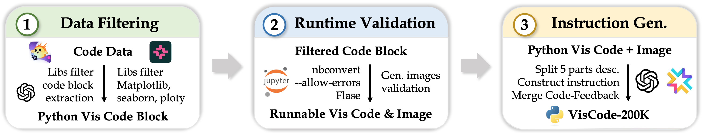
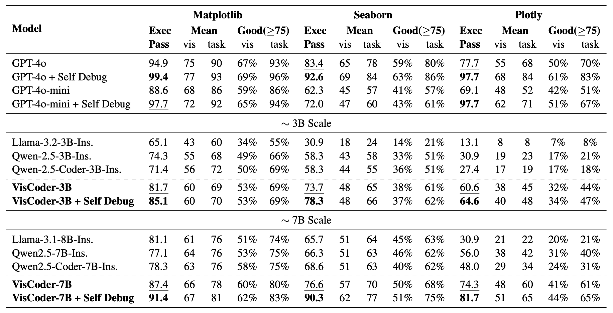

# VisCoder: Fine-Tuning LLMs for Executable Python Visualization Code Generation

[**🌐 Project Page**](https://tiger-ai-lab.github.io/VisCoder) | [**📖 arXiv**](https://arxiv.org/abs/2506.03930) | [**🤗 VisCode-200K**](https://huggingface.co/datasets/TIGER-Lab/VisCode-200K) | [**🤗 VisCoder-3B**](https://huggingface.co/TIGER-Lab/VisCoder-3B) | [**🤗 VisCoder-7B**](https://huggingface.co/TIGER-Lab/VisCoder-7B)

---

## 🔔 News

- **🔥 [2025-06-05] VisCoder and VisCode-200K are now publicly released! Check out our [paper](https://arxiv.org/abs/2506.03930) and [collections](https://huggingface.co/collections/TIGER-Lab/viscoder-6840333efe87c4888bc93046).**

## 🧠 Introduction

**VisCoder** is an open-source large language model fine-tuned for **Python visualization code generation and iterative self-correction**. It is trained on **VisCode-200K**, a large-scale instruction-tuning dataset tailored for executable plotting tasks and runtime-guided revision.

VisCoder addresses a core challenge in data analysis: generating Python code that produces not only syntactically correct, but also **visually meaningful plots**. Unlike general code generation tasks, visualization requires grounding across **natural language instructions, data structures**, and **rendered visual outputs**.

To enable this, **VisCode-200K** includes:
- ✅ **150K+ executable visualization examples**, validated through runtime checks and paired with plot images.
- 🔁 **45K multi-turn correction dialogues** from the Code-Feedback dataset, providing supervision for fixing faulty code based on execution feedback.



We further propose a **self-debug evaluation protocol**, simulating real-world developer workflows through multi-round error correction. VisCoder is benchmarked on **PandasPlotBench** against GPT-4o, GPT-4o-mini, Qwen, and LLaMA, demonstrating robust performance and strong recovery from execution failures.

---
## 📊 Main Results on PandasPlotBench

We evaluate VisCoder on **PandasPlotBench**, a benchmark for executable Python visualization code generation across three libraries: **Matplotlib**, **Seaborn**, and **Plotly**. The figure below summarizes model performance in terms of execution success and GPT-4o-judged alignment scores.



> With **self-debug**, **VisCoder-7B** achieves over **90% execution pass rate** on both **Matplotlib** and **Seaborn**, outperforming strong open-source baselines and approaching GPT-4o performance on multiple libraries.

---

## 🛠️ Training & Evaluation

We provide both training and evaluation scripts for VisCoder.

- 📦 **Training** is performed using the [ms-swift](https://github.com/modelscope/swift) framework with full-parameter supervised fine-tuning on VisCode-200K.
- 📊 **Evaluation** is based on the [PandasPlotBench](https://github.com/JetBrains-Research/PandasPlotBench). We **augment the original evaluation** with an additional **Execution Pass Rate** metric and introduce a new **self-debug evaluation mode** that allows models to revise failed generations over multiple rounds.

See the following folders for details:

- [`train/`](./train): Training scripts and configurations based on ms-swift.
- [`eval/`](./eval): Evaluation scripts adapted from PandasPlotBench with our self-debug extension.

## Contact
- Yuansheng Ni: yuansheng.ni@uwaterloo.ca
- Wenhu Chen: wenhuchen@uwaterloo.ca

## 📖 Citation

**BibTeX:**
```bibtex
@article{ni2025viscoder,
  title={VisCoder: Fine-Tuning LLMs for Executable Python Visualization Code Generation},
  author={Ni, Yuansheng and Nie, Ping and Zou, Kai and Yue, Xiang and Chen, Wenhu},
  journal={arXiv preprint arXiv:2506.03930},
  year={2025}
}
```